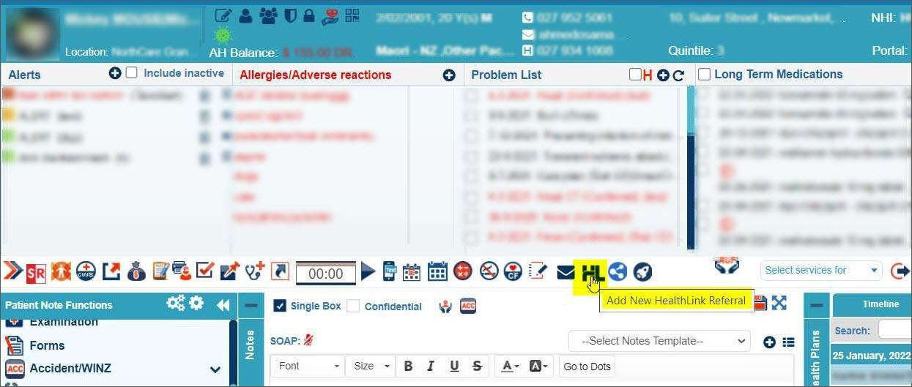
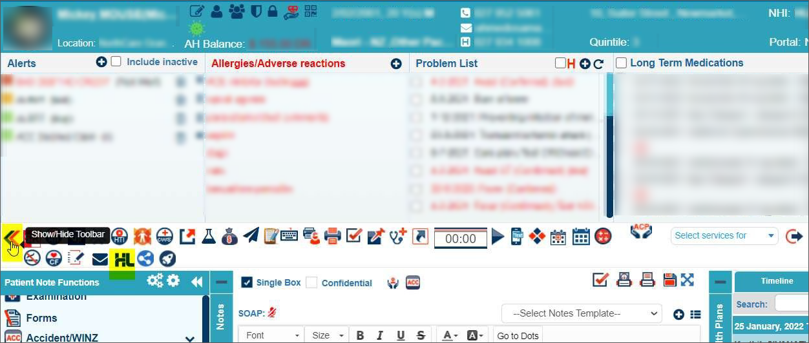
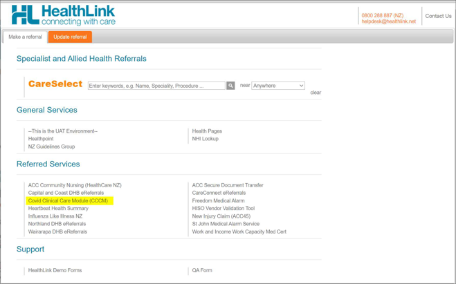

# **COVID Clinical Care Module (CCCM)**

## Launching Healthlink from Patient

1. Click the **Healthlink **icon on the consult toolbar:

If the Healthlink** **icon is not visible, please expand the consult toolbar to access the **Healthlink **icon:

COVID Clinical Care Module (CCCM)

2. The Healthlink portal will open for creating the CCCM form

In case you are unable to view the CCCM option please call or email Healthlink team at the following:

**Email:
**

citc@contacttracing.health.nz

or

sophie.maddern@health.govt.nz
