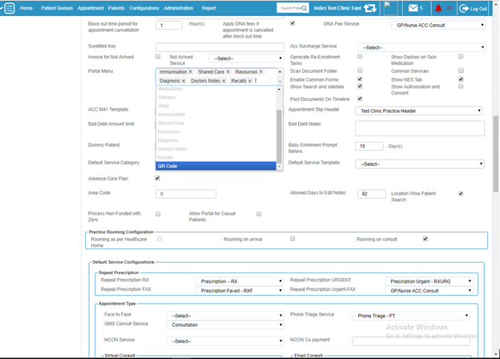
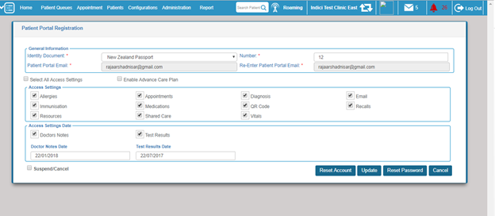
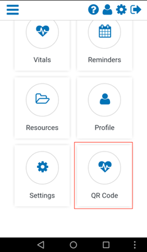
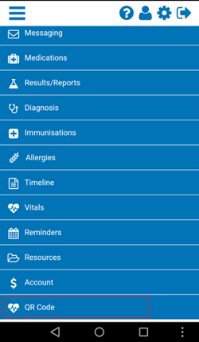
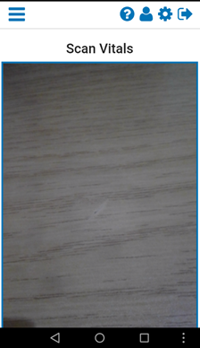
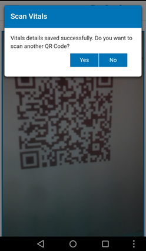
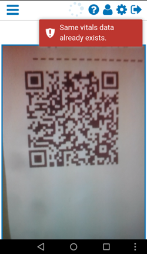
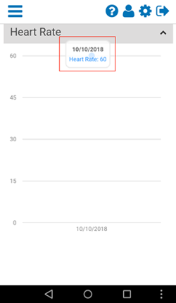
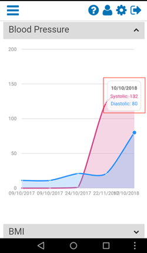
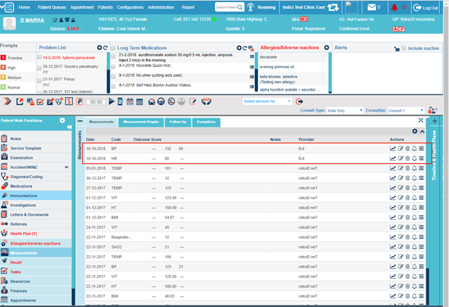

# Health Kiosk Integration Guide

## Introduction

The purpose of this document is to explain the functionality of scanning QR Code from MyIndici generated by Health Kiosk.

## Configuration

Following are the steps to configure and show QR Code menu in Patient Portal:

1. Login to Indici, go to Configurations -> General Configurations -> Practice -> Portal Menu section, then click on the section having menu names.
2. A drop down will appear, then select QR Code. After selecting the QR Code, click on Update button.

3. Go to Patients -> Search & List -> Click on the respective patient name. Patient Consult screen will be opened.
4. Click on the Portal Registered label. A popup window will appear having Patient Portal configuration setting options.
5. Check the QR Code checkbox under Access Settings and press Update button. Now QR Code menu will start appearing on MyIndici portal.

## QR Code Scanning

Following are the steps to scan QR Code from MyIndici:

1. Login to MyIndici App. Dashboard screen will appear where QR Code option is available. This option is also available in the menu. The patient can select QR Code from either option.

2. This will redirect user to QR Code scanning section. The following screen will appear:

3. Now scan the QR Code by placing the app in front of printed QR Code. Make sure that camera focuses on the QR Code.
4. After successful scanning, vitals details from the QR Code will be saved in the patient profile and a success message will appear. In the given image, we are saving Blood Pressure and Heart Rate data.

5. Clicking on Yes will start scanning another QR Code. Clicking No will redirect the user to the dashboard.
6. Patient cannot scan same QR Code or QR Code with same vitals on the same day. App will prompt "Same vitals data already exists."
7. After saving vitals data from QR Code, patient can view the date in Vitals section of MyIndici. Following is the image of saved Blood Pressure and Heart Rate data in Vitals Section.

## Viewing Vitals in Indici

Vitals data can also be viewed in Indici: open the Patient Consult -> Measurements.

