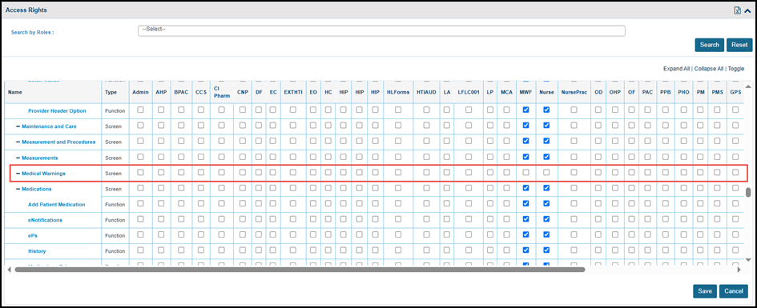
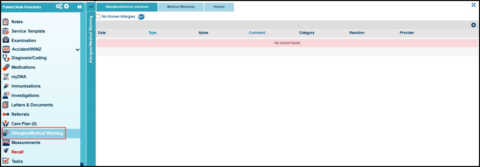
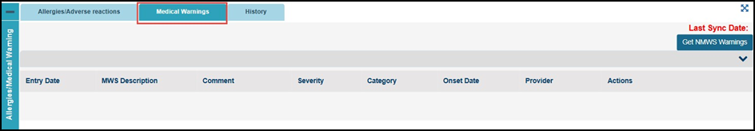
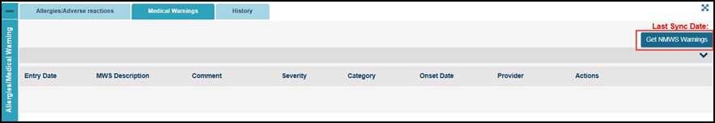
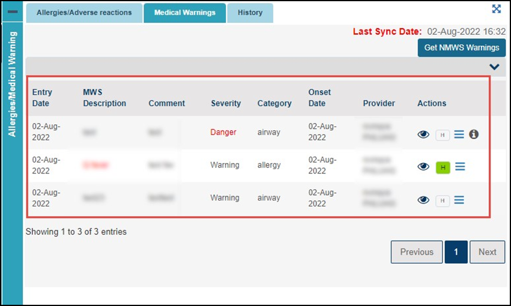
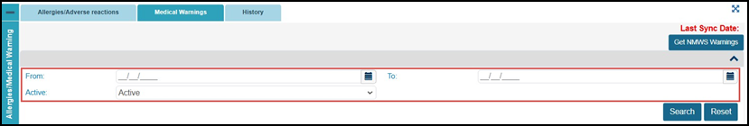

# Medical Warnings

Medical Warnings

Introduction

Our latest release introduces an important new feature that allows users to seamlessly pull

patient medical warning records from Health NZ into the indici system. The retrieved medical

warnings will be displayed under the "Allergies/Medical Warnings" section of the relevant

patientʼs consult screen in indici.

Requests to fetch the warnings are generated within indici using the Get NMWS Warnings

button, which triggers a backend script to display the data.

We have also provided useful filtering capabilities so users can search for medical warnings

based on specific criteria such as date and status.

 Configurations to Access Medical Warnings

To enable a user to access indici Medical Warnings, the user's role access rights must be

configured at the practice level. The following steps need to be followed to display the Medical

Warnings tab on the Patient Consult screen:

1. Log in to indici

2. Go to Configurations > User Management > Access Rights

3. Here you will see the Medical Warning permission. This allows you to control which user

roles have access to.

4. Mark the checkboxes under the user roles you want to have access to and click Save:

Medical Warnings Workflow

The below steps illustrate the complete flow of how medical warnings are displayed indici:

1. Go to Patients > Search & List:

2. On the Search & List screen, click the name of the relevant patient to open their Consult

screen.

3. In the left pane click the Allergies/Medical Warnings option:

4. Click the Medical Warnings tab:

5. To fetch medical warnings from Health NZ, click the Get NMWS Warnings button. A script is

executed in the backend, ensuring that the most up-to-date medical warnings from Health NZ

are retrieved and displayed accurately:

6. The medical warnings retrieved from Health NZ will be displayed as highlighted in the below

image:

7. The users can filter medical warning records by Date and Status to search and view relevant

records:

Date Filter: Allows users to specify a date range or select specific dates when searching for

medical warnings.

Status Filter: Enables users to filter warnings by their current status (e.g. Active, Inactive):
## Extracted Images

