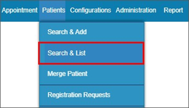

# Medical Warnings[¶](#medical-warnings)

## Introduction

Our latest release introduces an important new feature that allows users to seamlessly pull patient medical warning records from Health NZ into the indici system. The retrieved medical warnings will be displayed under the "Allergies/Medical Warnings" section of the relevant patientʼs consult screen in indici.

12

Requests to fetch the warnings are generated within indici using the Get NMWS Warnings

button, which triggers a backend script to display the data.

We have also provided useful filtering capabilities so users can search for medical warnings

based on specific criteria such as date and status.

Configurations to Access Medical Warnings

To enable a user to access indici Medical Warnings, the user's role access rights must be

configured at the practice level. The following steps need to be followed to display the Medical

Warnings tab on the Patient Consult screen:

roles have access to.

Medical Warnings Workflow

The below steps illustrate the complete flow of how medical warnings are displayed indici:

screen.

executed in the backend, ensuring that the most up-to-date medical warnings from Health NZ

are retrieved and displayed accurately:

image:

records:

Date Filter: Allows users to specify a date range or select specific dates when searching for

medical warnings.

Status Filter: Enables users to filter warnings by their current status (e.g. Active, Inactive):

## Extracted Images[¶](#extracted-images)

