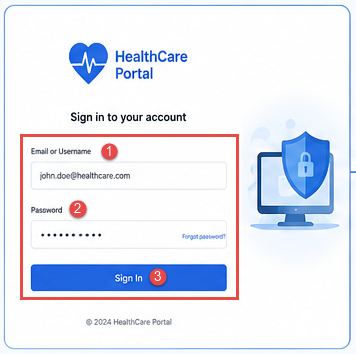
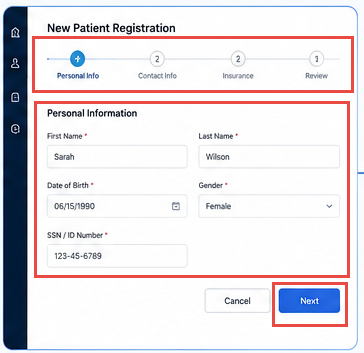
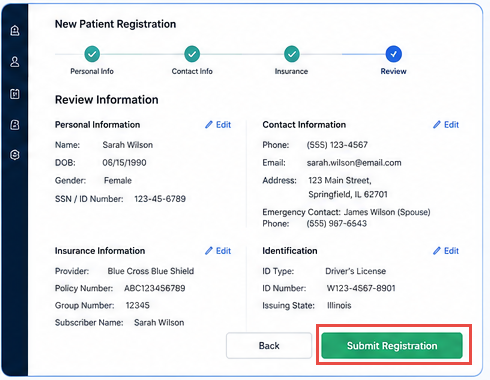

<h1> Register a New Patient </h1>

Create a complete patient profile for care coordination by following the registration process below.

### Step 1 – Sign in to the Portal

Log in to the Patient Management Portal using your authorized username and password.

---

### Step 2 – Create a New Patient Record

Select New Patient from the dashboard to start a new registration.

 

---

### Step 3 – Enter Personal Information

Fill in the patient's:

<li> 
- Full Name
- Date of Birth
- Gender or Title
- Phone Number
- Email Address
</li>

---

### Step 4 – Add Contact Details

Provide:

- Current Address
- Emergency Contact Name
- Emergency Contact Phone Number

---

### Step 5 – Insurance Information

Enter any required:

- Insurance Number
- Identification Number

---

### Step 6 – Review the Information

Review all entered information carefully before submitting the registration.

---

### Step 7 – Submit Registration

Click **Submit** to create the patient profile.

After submission, verify that the patient record is successfully created.

---

# Verify the Registration

> ✔ Confirm the patient record appears in the system.

> ✔ Verify the status is **Active** or **Complete**.

> ✔ If required information is missing, update the record before scheduling appointments.

---

## Next Steps

Once registration is complete, continue with:

- Appointment Scheduling
- Intake Review
- Care Coordination