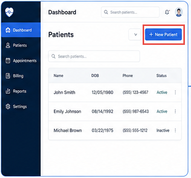

# Register a Patient

Create a complete patient profile for care coordination by following the registration process below.

## Steps to Follow

1. Log in to the Patient Management Portal using your authorized username and password.

     

2. Select **New Patient** from the dashboard.

    

3. Enter the patient's information:

    - Full Name
    - Date of Birth
    - Gender or Title
    - Phone Number
    - Email Address

        

4. Enter the patient's address details:

    - Current Address
    - Emergency Contact Name
    - Emergency Contact Phone Number

5. Enter any required information:

    - Insurance Number
    - Identification Number

6. Review all entered information.

7. Click **Submit** to create the patient profile.

    

8. Verify that the patient record has been created successfully.

---

## Verify the Registration

- Confirm the patient record appears in the system.
- Verify the status is **Active** or **Complete**.
- Update the record if any required information is missing.

---

## Next Steps

- Book an Appointment
- Manage Appointments
- Care Coordination