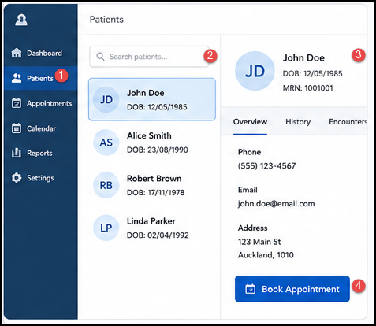
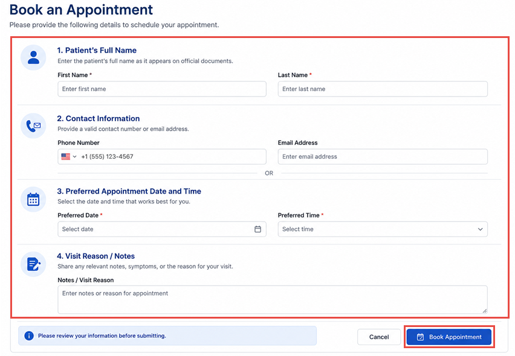
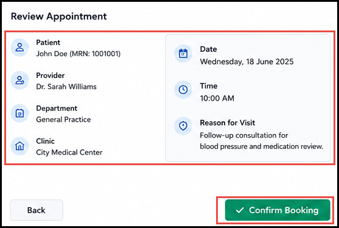

# Book an Appointment

This guide explains how to book an appointment for a patient. For instructions on managing an appointment after it's booked, see [Manage Appointments](../manage-appointments/).

## Overview

To book an appointment, find the patient, select a date and time, choose the provider and location, and confirm the details before saving.

## Before You Begin

Make sure you have the following available:

- The patient's name, so you can find their record (or their details, if they're not yet registered).

- A phone number or email address for the patient, if this isn't already on file.

- The reason for the visit.00

## Find or Select a Patient

1. Open the **Patients** section.

2. Use the **Search patients** field to find the patient by name.

3. Select the patient from the results to open their record.

If the patient isn't registered yet, use the **+ New Patient** option to add them before booking an appointment.

## Open the Appointment Booking Screen

From the patient's record, select **Book Appointment** to start booking.

## Select Appointment Date and Time

1. Use the calendar to select the appointment date.

2. Select an available time from the **Available Times** list.

3. Select **Next** to continue.

Only times that are currently available are listed.

## Select the Provider

Select the provider the appointment is with.

## Select the Department and Clinic

Select the department and clinic the appointment is with.

## Enter or Confirm Appointment Details

1. Confirm or update the patient's contact details (phone number or email address — at least one is required).

2. Enter the reason for the visit in the **Notes / Visit Reason** field.

**Required fields:** First Name, Last Name, Preferred Date, and Preferred Time. Provide at least a phone number or an email address. The notes/visit reason field is optional.

## Confirm and Save the Appointment

1. Review the appointment details: patient, provider, department, clinic, date, time, and reason for visit.

2. Select **Confirm Booking** to save the appointment, or **Back** to make changes.

## Verify the Appointment

After confirming, check that the appointment appears in the patient's appointment record. See [Viewing Appointments](../manage-appointments/#viewing-appointments) for how to find it.

## Common Booking Scenarios

- **New patient, no existing record:** register the patient first using **+ New Patient**, then follow this guide to book their appointment.

- **Patient calls to book on the phone:** find their record using [Find or Select a Patient](#find-or-select-a-patient), then complete the booking on their behalf.

- **Appointment needs to change after booking:** see [Manage Appointments](../manage-appointments/).

## Important Notes

Note

Only fields visible in the current booking screens are documented here. Provider, department, and clinic are confirmed as real fields on the review screen, but the exact screens used to select them aren't available in the project's source material — confirm the exact steps with your system administrator if this guide doesn't match what you see.

## Troubleshooting

- **Can't find the patient:** double-check the spelling of the patient's name, or confirm the patient is registered.

- **No suitable time available:** the **Available Times** list only shows times that are currently bookable. Try a different date, or contact the practice for options.

- **Need to change appointment details after booking:** use **Back** on the review screen before confirming, or see [Manage Appointments](../manage-appointments/) to make changes after the appointment is saved.
