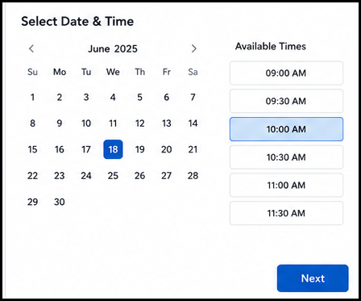

# Book an Appointment

This guide explains how to book an appointment for a patient using the system.

## Before You Begin

Make sure you have the following available:

- The patient's full name
- A valid contact number or email address
- The preferred appointment date and time
- Any relevant notes or visit reason

## Start the Booking Process

1. Sign in to the patient management portal.
2. Open the patient record for the person you are scheduling.

    

3. Select the option to book an appointment.
4. Choose the appropriate clinic, department, or provider.
5. Select the preferred date and time.

    

6. Enter the reason for the visit.
7. Review the appointment details and confirm the booking.

    

## Confirm the Appointment

After the appointment is created, verify that:

- The appointment status is shown as scheduled
- The correct patient and provider are displayed
- The date, time, and location are accurate

If any detail is incorrect, update the appointment before the patient arrives.

## Tips

- Book appointments as early as possible to avoid delays.
- Confirm the patient's preferred contact method before sending reminders.
- Add notes for special requirements, such as accessibility or interpreter needs.

## Next Steps

After booking the appointment, you can review the schedule, send reminders, or prepare the patient's visit documentation.
