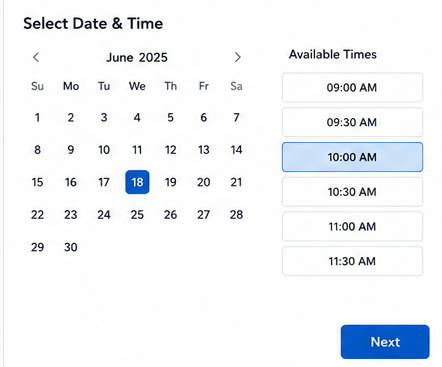

# Manage Appointments

This guide explains how to manage appointments that have already been booked for a patient. For instructions on creating a new appointment, see [Book an Appointment](book-appointment.md).

## Overview

Appointment management covers the tasks staff perform after an appointment exists: finding it, reviewing its details, updating it, and tracking what happens to it over time. This guide is for receptionists, practice staff, and clinical staff who work with existing patient appointments.

## Viewing Appointments

Appointments are shown in the appointment list, where scheduled appointments can be reviewed by patient, provider, or day.

<!-- Screenshot needed: appointment list view -->

## Searching for an Appointment

Use the search option to locate a specific appointment when you know details such as the patient's name.

1. Open the appointment list.
2. Enter the patient's name or another identifying detail in the search field.
3. Select the matching appointment from the results.

<!-- Screenshot needed: appointment search field and results -->

## Filtering Appointments

Filters narrow the appointment list to a smaller, more relevant set of appointments, such as those for a specific date, provider, or appointment status.

1. Open the appointment list.
2. Select the filter options relevant to what you're looking for.
3. Apply the filters to update the list.

<!-- Screenshot needed: appointment list filter controls -->

## Opening Appointment Details

Opening an appointment shows its full details, including the patient, provider, date and time, and any notes recorded against it.

1. Locate the appointment using the appointment list, search, or filters.
2. Select the appointment to open its details.

<!-- Screenshot needed: appointment details view -->

## Editing an Appointment

Once an appointment is open, its details can be updated. Save your changes after making an update so the appointment reflects the new information.

### Changing the Appointment Date or Time

1. Open the appointment.
2. Select the option used to change the date or time.
3. Choose the new date and an available time.
4. Confirm the change.

### Changing the Appointment Type or Provider

1. Open the appointment.
2. Select the option used to change the appointment type or provider.
3. Choose the new appointment type or provider.
4. Save the changes.

### Changing Appointment Status

1. Open the appointment.
2. Select the option used to change the appointment status.
3. Choose the status that reflects the current state of the appointment.
4. Save the changes.

## Cancelling an Appointment

1. Open the appointment.
2. Select the option used to cancel the appointment.
3. Confirm the cancellation.

!!! note
    Cancelling an appointment removes it from the active schedule. Exact behavior around patient notifications and freed time slots depends on your practice's configuration — confirm this with your system administrator if you're unsure.

## Rescheduling an Appointment

1. Open the patient's appointment.
2. Select the option used to change the appointment.
3. Select the new date and time.
4. Confirm the appointment details.
5. Save the changes.

For details on selecting a new date and time, see [Changing the Appointment Date or Time](#changing-the-appointment-date-or-time).

## Recording Appointment Notes

Appointments can include notes, such as the visit reason recorded when the appointment was booked. When managing an existing appointment, review and update these notes as needed.

1. Open the appointment.
2. Locate the notes or visit reason field.
3. Add or update the note.
4. Save the changes.

## Managing Follow-up Appointments

A follow-up appointment is booked the same way as any new appointment. See [Book an Appointment](book-appointment.md) for the booking steps, and use the visit reason or notes to record that the appointment is a follow-up if relevant.

## Handling No-Shows

If a patient does not attend a scheduled appointment, update the appointment status to reflect this, following the steps in [Changing Appointment Status](#changing-appointment-status).

## Checking Appointment History

Past appointments for a patient can be reviewed through the appointment list by filtering to the patient and an earlier date range.

<!-- Screenshot needed: patient appointment history view -->

## Common Appointment Management Scenarios

- **Patient calls to change their appointment time:** see [Rescheduling an Appointment](#rescheduling-an-appointment).
- **Patient calls to cancel:** see [Cancelling an Appointment](#cancelling-an-appointment).
- **Patient didn't attend their appointment:** see [Handling No-Shows](#handling-no-shows).
- **Patient needs a further visit after this one:** see [Managing Follow-up Appointments](#managing-follow-up-appointments).

## Troubleshooting / Important Notes

!!! note
    The exact fields, statuses, and confirmation messages available when managing an appointment can vary by practice configuration and staff permissions. If a step in this guide doesn't match what you see on screen, confirm current behavior with your system administrator.

If you can't find an appointment, double-check the search terms and any active filters — an applied filter can hide appointments that don't match it.
